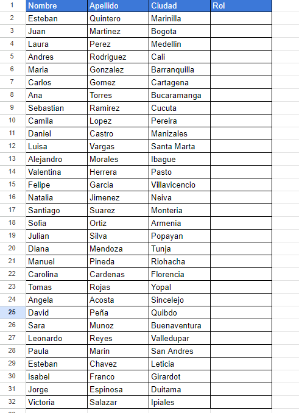

# Trabajo Cliente Servidor Universidad IberoAmericano

Este proyecto de cliente servidor, tiene una conexión con una API SHEETS que lo que hace es consultar datos y escribir
sobre un documento que se encuentra en Drive en la siguiente ruta:

https://docs.google.com/spreadsheets/d/1jJyAiAjGnERvrayNKwoaNvF-RTNg3ywR95X9smqs2tI/edit?gid=0#gid=0

Desde el proyecto puedes consultar los datos del excele ingresando un número de usuario, EJ: 1, 2, 3, 4 etc
El archivo cuenta con 31 Usuarios.

 </img>

## Precondiciones para ejecutar el proyecto

Debe tener instalado gradle, ya que es este el gestor de dependecias que utilicé para descarga de librerías etc etc.

# Funcionalidad y ejecución del código

Teniendo en cuenta la tabla en Drive, por consola nos indica que ingresemos el número de usaurio que queremos consultar

SI el usuario tiene un Rol asignado solo lo va a mostrar en pantalla y preguntará si desea realizar otra consulta

SI el usuario no tiene un Rol asignado preguntará si desea asignar un rol y posterior te pedirá el nombre de ese rol (Puede asignar cualquier nombre)

### !!!Atención!!!
El código es simple, no cuenta con muchas validaciones de la entrada de los datos, así que por favor asegurese de leer bien 
los datos que le está solicitando, de lo contrario no va a funcionar como debería.

Muchas gracias.